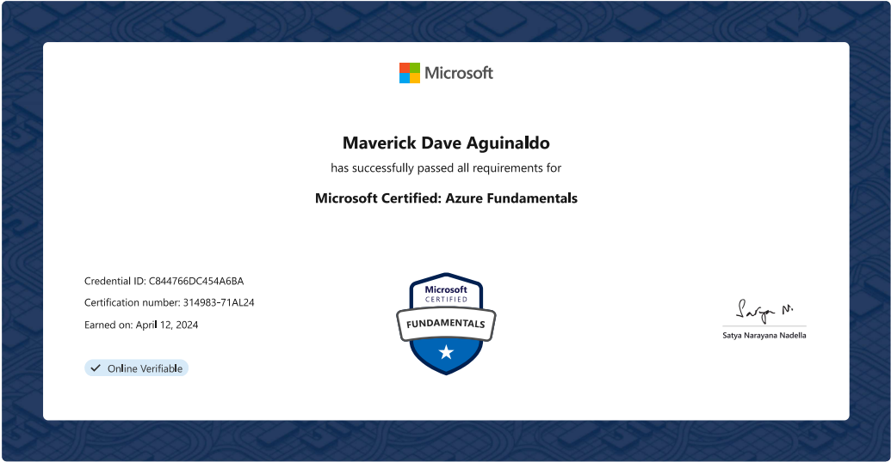

# Trainings and Certifications

This repository contains a list of trainings and certifications I have completed throughout my career.

## Table of Contents

-	[Trainings and Certifications](#trainings-and-certifications)
-	[Passed Certifications](#passed-certifications)
-	[Photos](#photos)
-	[LeetCode](#leetcode)

## Trainings and Certifications

[**Mastering Collaboration: Work together for the best results**](https://www.udemy.com/certificate/UC-2e6abebc-714d-4e94-a181-7f5fa0106d43/) by **Udemy (Dec 2024)**
- What you'll learn:  
	-	The benefits of collaboration and why it’s an essential part of how businesses get work done today
	-	The fundamentals of forming and leading a collaborative team
	-	Online collaboration and how to effectively collaborate across different teams
	-	What you need to create and support a thriving culture of collaboration
	-	How to ensure collaborative teams work successfully within a company
	-	How to organize and get the most out of collaborative meetings
	-	Collaboration lessons you can apply from different industries
	
[**Agile Scrum Mastery**](https://www.udemy.com/certificate/UC-c7b603cd-f90f-49b1-ada4-47b18ebd4190/) by **Udemy (Sep 2024)**
- What you'll get in this course:  
	- A proven formula developed and refined over 4 years, that maximizes your chance of  **passing PSM 1 on your first attempt [Students experience 98% pass rate]**
	- The only course that covers both 
		- how to  **pass PSM (Professional Scrum Master™) 1 Certification**  & 
		- how to  **succeed in a Scrum team**  via real world project simulations run in JIRA, Confluence & Physical Scrum boards.
	- 6.5 hours of courses taught in a fun & engaging format, with a focus on  **learning by doing**.
	- Over  **500 exclusive practice exam** questions that let you study in both  
		- **learning mode** & 
		- **exam simulation mode**
	- Access to our community of over  **3,800 professionals**  for networking, collaboration & group study. 
	- Detailed PSM 1 study notes designed to help you  **quickly review and revise study material**, before taking the PSM 1 exam.  
	- The instructor,  **Raj Elakkara**, has over 15 years of experience coaching Agile teams in both large Fortune 500 companies (such as FedEx, GE, Canva & Atlassian.) & startups. This course is the result of extensive research into Passing Scrum certification & learning real-world Agile in an online study format.

[**Azure Data Factory For Data Engineers**](https://www.udemy.com/certificate/UC-15304280-6299-4037-960e-dc8a461b64d8/) by **Udemy (August 2024)**
- What you'll learn in this course (Azure Data Factory For Data Engineers - Project on Covid19) are the following:
	-   How to build a real-world data pipeline in Azure Data Factory (ADF).
	-   Data Engineering skills in Azure using ADF, Azure Data Lake Storage Gen2, Azure SQL Database, and Azure Monitor.
	-   How to ingest data from sources like HTTP and Azure Blob Storage into Azure Data Lake Gen2 using ADF.
	-   How to transform data using Data Flows in ADF and load it into Azure Data Lake Storage Gen2.
	-   How to transform data using Databricks Notebook Activity in ADF and load it into Azure Data Lake Storage Gen2.
	-   How to transform data using Azure HDInsight Activity in ADF and load it into Azure Data Lake Storage Gen2.
	-   How to load transformed data from Azure Data Lake Storage Gen2 to Azure SQL Database using ADF.
	-   Extensive knowledge about Triggers in ADF and how to use them to schedule data pipelines.
	-   How to monitor pipelines using ADF, Azure Monitor, and Log Analytics with a real-world project.
	-   How to build production-ready pipelines, including best practices and naming standards.
	-   Topics required for the Azure Data Engineer Associate Certification Exam DP203 related to ADF.
	-   How to create CI/CD pipelines in Azure DevOps to release ADF pipelines to higher environments (Testing/Production).

[**Feedback & Perfomance Management**](https://www.udemy.com/certificate/UC-6e0d2f86-c63a-44b2-96ae-6bcf0ec92226/) by **Udemy (May 2024)**
- What you'll learn in this course are the following:
	- How to build trust within teams, within organizations, or as a new manager.
 	- Verbal, group, and digital communication skills associated with performance management and giving and soliciting feedback.
  	- Specific modalities for soliciting and giving feedback (e.g. group feedback, digital feedback, one-on-ones, coaching, and more).
  	- The fundamentals of people operations, people analytics, and the movement towards continuous feedback and continuous performance improvement practices. 
  
[**Presentation Skills: Give a Great Team Presentation**](https://www.udemy.com/certificate/UC-7aa5f959-279f-4842-8e79-113f9be8159c/) by **Udemy (May 2024)**
- In this course, you will learn how to develop messages, make team assignments, and practice your presentations, as a team. Most team presentations are dreadful and boring because executives tell themselves "I'm now giving a team presentation, so of course, we all have to read boring bullet-point messages off of a PowerPoint slide because that is how serious business people do things." This is a fallacy. TJ Walker is an expert Presentation Skills coach who has prepped and rehearsed executives from major corporations and institutions around the world on how to make better team presentations. 

[**Leading Effective Meetings**](https://www.udemy.com/certificate/UC-7f9e20b0-99da-4e95-821a-69808ab526cd/) by **Udemy (May 2024)**
- Learn how to effectively plan, run, & manage meetings of any kind. Increase your team's productivity & participation

[**(Refresher) MySQL Bootcamp: Go from SQL Beginner to Expert**](https://www.udemy.com/certificate/UC-9b41a09b-cf8a-497d-a92e-5cb568ba82cf/) by **Udemy (Apr 2024)**
- This course was **just completely redone and rebuilt**  from the ground up, with over 325 brand new videos recorded. The course now uses  **MySQL 8.x**  and covers new topics including:  **Window Functions**,  **Views**, and **SQL modes**.
- If you want to learn how to gain insights from data but are too intimidated by databases to know where to start, then this course is for you. This course is a gentle but comprehensive introduction to MySQL, one of the  **most highly in-demand skills**  in the business sector today.
- Whether you work in sales or marketing, you run your own company, or you want to build your own apps, mastering MySQL is crucial to answering complex business problems and questions using insights from data.  _The Ultimate MySQL Bootcamp_  introduces you to a solid foundation in databases in a way that’s both informative and engaging. Yes, that’s right, it’s possible to make an engaging course on databases.
- In this course, you will:
	- Learn the ins and outs of  **SQL syntax**
	- Generate reports using  **sales and user data**
	- Analyze data using  **Aggregate Functions**
	- Run complex queries using MySQL **logical operators and string functions**
	- Write all the common  **SQL joins**
	- Work with  **large datasets containing thousands of entries**
	- Design and implement complex database schemas
	- Learn to navigate the treacherous world of storing dates and times
	- Clone the database structure of a  **photo sharing social network**
	- Work with  **MySQL 8.x Window Functions**: RANK, LEAD, LAG, NTILE, etc.
	- Create  **MySQL database views**  and virtual tables
- This course is also chock full of **exercises, challenges, projects, and opportunities**  for you to practice what you’re learning. Apply what you’re learning to real-world challenges such as finding a website’s power users, calculating your top students, identifying bots on a site, or determining which hashtags generate the most traction on a site.
  
[**AZ-900: Microsoft Azure Fundamentals Exam Prep**](https://www.udemy.com/certificate/UC-b311f136-8598-4d01-8acc-78d12d9040d5/) by **Udemy (Apr 2024)**
- Learn the fundamentals of Azure, and get certified, with this complete beginner's AZ-900 course, includes practice test!

[**Advanced SQL Server Performance Tuning**](https://www.udemy.com/certificate/UC-95ac1709-d619-4220-b3c9-95bcfb3dcead/) by **Udemy (Mar 2024)**
- This course will give  **YOU**  deeper insight into what it takes to become a skilled  **PERFORMANCE TUNER**. Once thought of as an art, performance tuning is nothing more than a series of processes that seek to accomplish  **TWO**  basic goals.
	-	The FIRST one is to  **increase the  _response time_**  for a given transaction or set of transactions.
	-	The SECOND one is  **reduce  _resource consumption_**. On the surface this sounds simple but nothing could be further from the truth.

[**Analyzing and Visualizing Data with Microsoft Power BI**](https://www.udemy.com/certificate/UC-9fcbdf7a-c838-4d71-8a5d-5c8b8ccb3587/) by **Udemy (Oct 2023)**
- This course will help you in starting with Power BI in no time from scratch, you will learn :
	-	**Installing**  Power BI
	-	**Getting Data**  in Power BI from  **various sources**
	-	**Modify and clean the data**  as per the need
	-	**Merging/Joining**  various data streams
	-	**Visualizing data**  using various methods
	-	Using various features of Power BI to  **enrich the data/visualization**
	-	Doing  **What-If Analysis**  on the data
	-	**Publishing**  them to web
	-	Using Power BI services to  **find insights**  from Data
	-	Creating Power BI  **Reports and Dashboards**
	-	Consuming  **Power BI on Mobile**

[**Personal Data Breach Training**](https://www.udemy.com/certificate/UC-c428f97d-3f99-4a9f-a3db-60d29b799d1c/) by **Udemy (Oct 2023)**
- This course / module / training discusses how to handle data breaches for Inchcape Digital Philippines employees.
	- Module contents:
		- What is personal data?
		- What is personal data breach?
		- Causes of security incidents on personal data.
		- Types of security incidents on personal data.
		- How are personal data classified?
		- Personal data breach notification procedure.

[**Emerging Leader Training**](https://www.credential.net/c8109d0b-53f5-42fd-870b-da12e2ca08a4#gs.6dho8c) by **Inchcape Digital (Oct 2023)**
- This digital credential is awarded to Inchapers who have attended, completed and exhibited the skills and knowledge from the Emerging Leader Training: The Next Generation held in Acacia Hotel Manila from October 12-13, 2023 . The recipients of this digital credential possess the essential competencies that makes an Inchcape Digital Leader best-in-class as they exhibit One Inchcape Values and Behaviour.

[**Philippine Data Privacy Act of 2012 (PDPA) and the UK General Data Protection Regulation (UK GDPR)**](https://www.udemy.com/certificate/UC-56a003ec-de59-447b-9bd2-f110b0b7ae1c/) by **Udemy (Sept 2023)**
- This course gives employees an overview of two (2) regulations in Data Privacy namely the  Philippine Data Privacy Act of 2012 (PDPA) and the UK General Data Protection Regulation (UK GDPR). The course will cover the following topics:
	-	The definition of personal information
	-	The types of personal information that are protected under the PDPA and UK GDPR
	-	The principles of data privacy
	-	The rights of data subjects
	-	The obligations of organizations that process personal information
	-	The penalties for violating the PDPA and UK GDPR

[**ChatGPT: Complete ChatGPT Course For Work 2023**](https://www.udemy.com/certificate/UC-fde000ad-7d42-40c5-bbe6-26aaaf94a1dd/) by **Udemy (Jun 2023)**
- Learned on this course:
	- 	Using ChatGPT To Dramatically Increase Your Productivity. Hot Tips That Many Are Not Aware Of.
	- Using ChatGPT To Improve Your Writing Skills & Shorten Writing Time.
	-	Leveraging ChatGPT For Regular Tasks Like Email, Report Writing, Blogs, Presentation Scripts, And Much More.
	-	Surprising Areas Like Code Debugging, Translation, & Summarizing Long Documents You Need To Read.
	-	Use ChatGPT To Educate Yourself In Soft Skills & Hard Skills. Virtually No Limit.
	-	Demo Of Many Ways You Can Use ChatGPT At Work Plus Some Personal Ways You Can Use It As Well.

**Zero to Snowflake – Virtual Hands-On Lab** by **Snowflake (Apr 2023)**
- This virtual hands-on lab provided a comprehensive introduction to Snowflake, a cloud-based data warehousing and analytics platform. The lab covered the following topics:
	-   Snowflake architecture and data loading
	-   Data storage and management
	-   Querying and optimizing data with Snowflake
	-   Advanced topics, such as security and governance

**Advanced SQL: Logical Query Processing [Part 1](https://www.linkedin.com/learning/certificates/40a6b99cc0cc4ff035a1cb741ed8f419f9046ebbf2d2fd3c970a33fc480c3003), [Part2](https://www.linkedin.com/learning/certificates/a2a1dbe23289c96126fc71f99d2971f2e81780cb0f3a4f28bb72b9bfdcf8722d)** by **LinkedIn Learning (Feb 2023)**
- This training course covered advanced SQL concepts, including logical query processing and optimization.

[**Data Engineering Foundations**](https://www.linkedin.com/learning/certificates/e6c648895f5ebf2d971842fbbbe33eac6201f6d4723392d347eab5ad2000c3d5) by **LinkedIn Learning (Feb 2023)**
- This training course covered the following topics:
	-   ETL (Extract, Transform, Load)
	-   PostgreSQL database
	-   Apache Spark framework
	-   Python programming language for data engineering
	-   Apache Airflow workflow management tool

[**SQL**](https://www.sololearn.com/certificates/CT-RNHNIWK6) by **Sololearn (Dec 2022)**  &   **[Introduction to SQL](https://simpli-web.app.link/e/FC3NiF6GGwb)** by **Simplilearn (Jan 2023)**
- This training course provided a comprehensive introduction to SQL, covering the following topics:
	- Database fundamentals
	- Data definition language (DDL) and data manipulation language (DML)
	- Select statements
	- Functions and operators
	- Joins and subqueries
	-   Indexes and performance tuning
	-   Transactions and concurrency control
	-   Views and stored procedures
	-   Security and access control

[**AWS Introduction to Cloud 101**](https://www.credly.com/badges/33ca67ad-0e36-4f5f-ab17-655aaa5e874d/linked_in_profile) by **AWS Educate (Apr 2022)**
-	This training course covered the fundamentals of cloud computing and Amazon Web Services (AWS).

## Passed Certifications

**[Microsoft Certified: Azure Data Fundamentals](https://learn.microsoft.com/api/credentials/share/en-us/davdavid29/906D15D7E665DD4A?sharingId=65EB120B76C95D80)** by **Microsoft (Sep 2024)**
- The Microsoft DP-900 Azure Data Fundamentals certification assesses foundational knowledge of core data concepts and Microsoft Azure data services, catering to individuals beginning their journey in data management and analytics. Covering essential topics like relational and non-relational data, data workloads, data processing, and analytics on Azure, this certification validates an understanding of fundamental database concepts and the implementation of Azure data solutions. Passing the exam demonstrates competence in describing core data concepts, identifying key Azure data services, and comprehending the fundamentals of data storage, processing, and analysis on Azure.

**[Microsoft Certified: Azure Fundamentals](https://learn.microsoft.com/en-us/users/davdavid29/credentials/c844766dc454a6ba?ref=https%3A%2F%2Fwww.linkedin.com%2F)** by **Microsoft (Apr 2024)**
- The Microsoft AZ-900 Azure Fundamentals certification assesses foundational knowledge of cloud services and Microsoft Azure, catering to beginners in cloud computing. Covering essential concepts like cloud models, core Azure services, pricing, governance, security, and monitoring, the certification validates an understanding of fundamental cloud principles and Azure functionalities. Passing the exam demonstrates competence in describing basic cloud concepts, identifying key Azure services, and comprehending Azure pricing, governance, security, and monitoring fundamentals.
 
 **[Certified SQL Developer](https://verify.w3schools.com/1NCSKCULU1)** by **W3Schools (Jan 2023)**
 - This certification validates my skills and knowledge in SQL, including database design, querying, and optimization. The certification exam covered the following topics:
	 - Relational database concepts
	 - Data manipulation language (DML) statements
	 - Data definition language (DDL) statements
	 - Data control language (DCL) statements
	 - Transaction management
	 - Database optimization and performance tuning
	 - Database security and access control
	 - Backup and recovery strategies
	 - Common database architectures

## Photos

### Professional Certifications:

### Other Certifications:

|  |  | 
|----------|----------|
|  |  | 
|  |  | 
|  |  | 
|  |  | 

## LeetCode

-   LeetCode profile: [**https://leetcode.com/davdavid29/**](https://leetcode.com/davdavid29/)
-   [**LeetCode SQL Solved Problems**](https://leetcode.com/davdavid29/)
