# Trainings and Certifications

This repository contains a list of trainings and certifications I have completed throughout my career.

## Table of Contents

-	[Trainings and Certifications](#trainings-and-certifications)
-	[Passed Certifications](#passed-certifications)
-	[Photos](#photos)
-	[LeetCode](#leetcode)

## Trainings and Certifications

-   [**AWS Introduction to Cloud 101**](https://www.credly.com/badges/33ca67ad-0e36-4f5f-ab17-655aaa5e874d/linked_in_profile) by AWS Educate (Apr 2022) - This training course covered the fundamentals of cloud computing and Amazon Web Services (AWS).

-   [**SQL**](https://www.sololearn.com/certificates/CT-RNHNIWK6) by Sololearn (Dec 2022)  &   **[Introduction to SQL](https://simpli-web.app.link/e/FC3NiF6GGwb)** by Simplilearn (Jan 2023)  - This training course provided a comprehensive introduction to SQL, covering the following topics:
	-   Database fundamentals
	-   Data definition language (DDL) and data manipulation language (DML)
	-   Select statements
	-   Functions and operators
	-   Joins and subqueries
	-   Indexes and performance tuning
	-   Transactions and concurrency control
	-   Views and stored procedures
	-   Security and access control

-   [**Data Engineering Foundations**](https://www.linkedin.com/learning/certificates/e6c648895f5ebf2d971842fbbbe33eac6201f6d4723392d347eab5ad2000c3d5) by LinkedIn Learning (Feb 2023) - This training course covered the following topics:
	-   ETL (Extract, Transform, Load)
	-   PostgreSQL database
	-   Apache Spark framework
	-   Python programming language for data engineering
	-   Apache Airflow workflow management tool

-   **Advanced SQL: Logical Query Processing [Part 1](https://www.linkedin.com/learning/certificates/40a6b99cc0cc4ff035a1cb741ed8f419f9046ebbf2d2fd3c970a33fc480c3003), [Part2](https://www.linkedin.com/learning/certificates/a2a1dbe23289c96126fc71f99d2971f2e81780cb0f3a4f28bb72b9bfdcf8722d)** by LinkedIn Learning (Feb 2023) - This training course covered advanced SQL concepts, including logical query processing and optimization.

-   **Zero to Snowflake – Virtual Hands-On Lab** by Snowflake (Apr 2023) - This virtual hands-on lab provided a comprehensive introduction to Snowflake, a cloud-based data warehousing and analytics platform. The lab covered the following topics:
	-   Snowflake architecture and data loading
	-   Data storage and management
	-   Querying and optimizing data with Snowflake
	-   Advanced topics, such as security and governance

 -	[**ChatGPT: Complete ChatGPT Course For Work 2023**](https://www.udemy.com/certificate/UC-fde000ad-7d42-40c5-bbe6-26aaaf94a1dd/) by Udemy (Jun 2023) - Learned on this course:
	- 	Using ChatGPT To Dramatically Increase Your Productivity. Hot Tips That Many Are Not Aware Of.
   	-	Using ChatGPT To Improve Your Writing Skills & Shorten Writing Time.
	-	Leveraging ChatGPT For Regular Tasks Like Email, Report Writing, Blogs, Presentation Scripts, And Much More.
	-	Surprising Areas Like Code Debugging, Translation, & Summarizing Long Documents You Need To Read.
	-	Use ChatGPT To Educate Yourself In Soft Skills & Hard Skills. Virtually No Limit.
	-	Demo Of Many Ways You Can Use ChatGPT At Work Plus Some Personal Ways You Can Use It As Well.

-	[**Philippine Data Privacy Act of 2012 (PDPA) and the UK General Data Protection Regulation (UK GDPR)**](https://www.udemy.com/certificate/UC-56a003ec-de59-447b-9bd2-f110b0b7ae1c/) by Udemy (Sept 2023) - This course gives employees an overview of two (2) regulations in Data Privacy namely the  **Philippine Data Privacy Act of 2012 (PDPA) and the UK General Data Protection Regulation (UK GDPR)**. The course will cover the following topics:
	-	The definition of personal information
	-	The types of personal information that are protected under the PDPA and UK GDPR
	-	The principles of data privacy
	-	The rights of data subjects
	-	The obligations of organizations that process personal information
	-	The penalties for violating the PDPA and UK GDPR

-	[**Emerging Leader Training**](https://www.credential.net/c8109d0b-53f5-42fd-870b-da12e2ca08a4#gs.6dho8c) by Inchcape Digital (Oct 2023) - This digital credential is awarded to Inchapers who have attended, completed and exhibited the skills and knowledge from the Emerging Leader Training: The Next Generation. The recipients of this digital credential possess the essential competencies that makes an Inchcape Digital Leader best-in-class as they exhibit One Inchcape Values and Behaviour.

-	[**Analyzing and Visualizing Data with Microsoft Power BI**](https://www.udemy.com/certificate/UC-9fcbdf7a-c838-4d71-8a5d-5c8b8ccb3587/) by Udemy (Oct 2023) - This course will help you in starting with Power BI in no time from scratch, you will learn :
	-	**Installing**  Power BI
	-	**Getting Data**  in Power BI from  **various sources**
	-	**Modify and clean the data**  as per the need
	-	**Merging/Joining**  various data streams
	-	**Visualizing data**  using various methods
	-	Using various features of Power BI to  **enrich the data/visualization**
	-	Doing  **What-If Analysis**  on the data
	-	**Publishing**  them to web
	-	Using Power BI services to  **find insights**  from Data
	-	Creating Power BI  **Reports and Dashboards**
	-	Consuming  **Power BI on Mobile**
-	[**Advanced SQL Server Performance Tuning**](https://www.udemy.com/certificate/UC-95ac1709-d619-4220-b3c9-95bcfb3dcead/) by Udemy (Mar 2024) - This course will give  **YOU**  deeper insight into what it takes to become a skilled  **PERFORMANCE TUNER**. Once thought of as an art, performance tuning is nothing more than a series of processes that seek to accomplish  **TWO**  basic goals.
		1. The FIRST one is to  **increase the  _response time_**  for a given transaction or set of transactions.
		2. The SECOND one is  **reduce  _resource consumption_**. On the surface this sounds simple but nothing could be further from the truth.

## Passed Certifications
    
 -   **[Certified SQL Developer](https://verify.w3schools.com/1NCSKCULU1)** by W3Schools (2023) - This certification validates my skills and knowledge in SQL, including database design, querying, and optimization. The certification exam covered the following topics:

	   -   Relational database concepts
	   -   Data manipulation language (DML) statements
	   -   Data definition language (DDL) statements
	   -   Data control language (DCL) statements
	   -   Transaction management
	   -   Database optimization and performance tuning
	   -   Database security and access control
	   -   Backup and recovery strategies
	   -   Common database architectures

## Photos

### Professional Certifications:

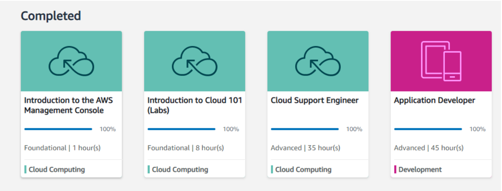

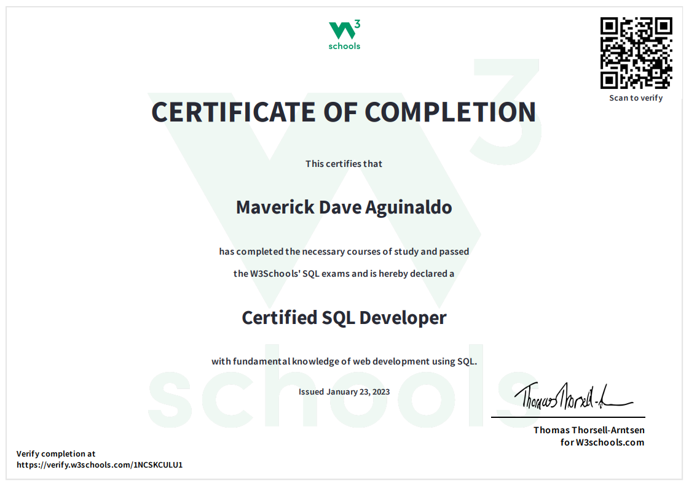

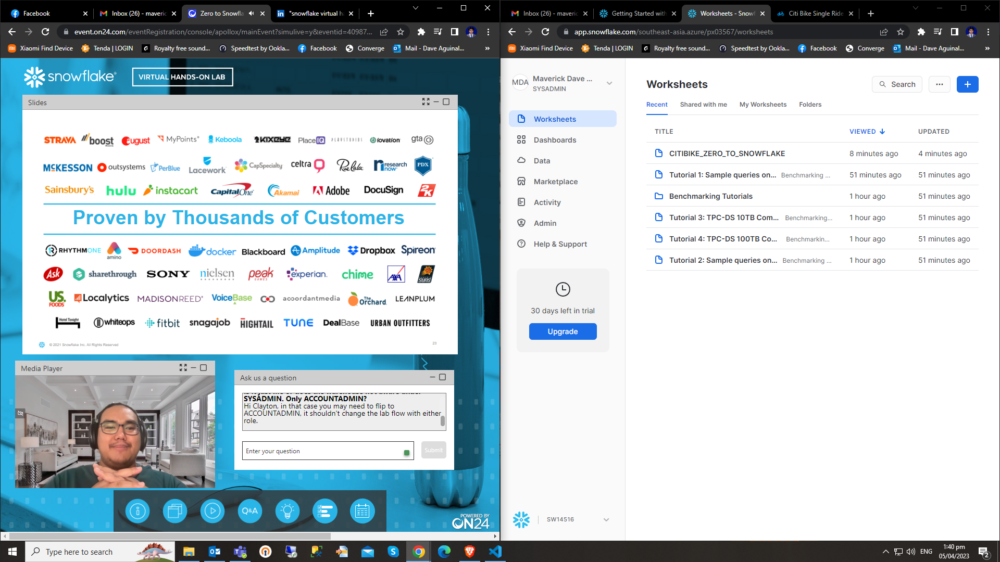

|  |  | 
|----------|----------|
| 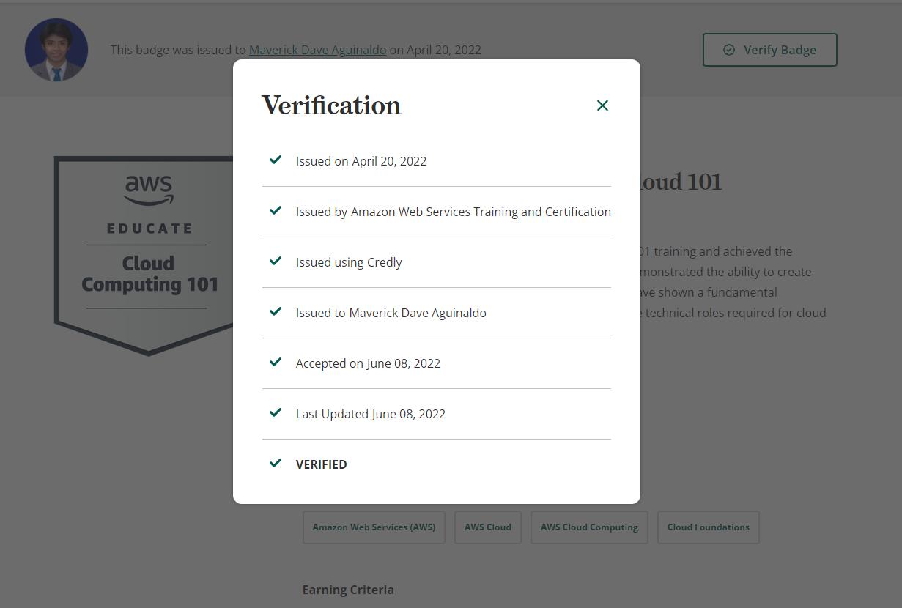 | 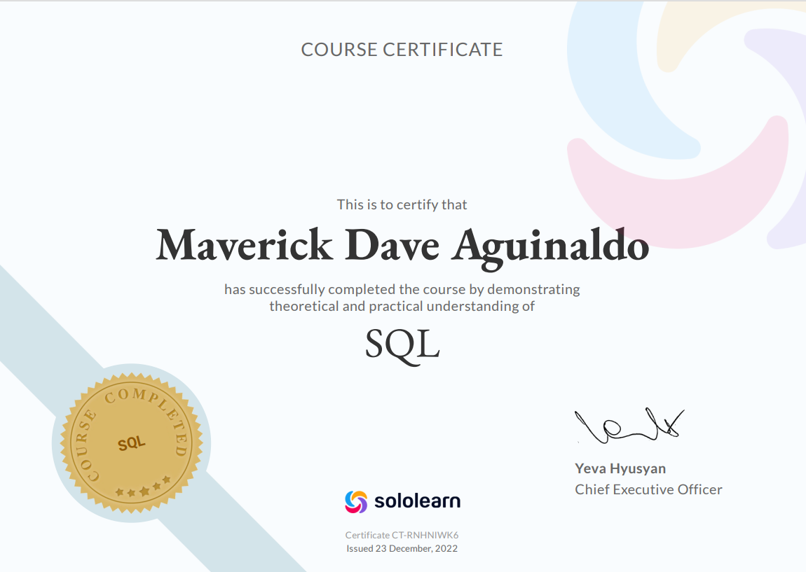 | 
|  | 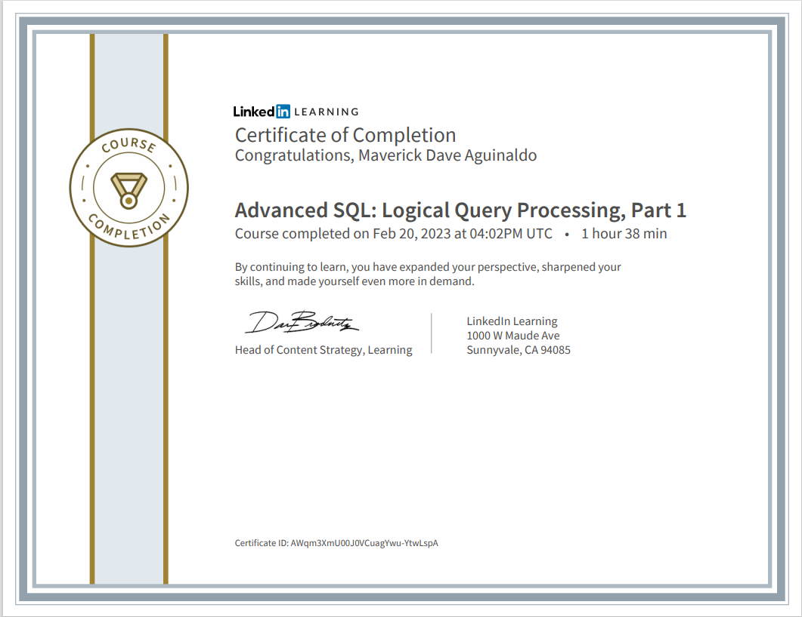 |
| 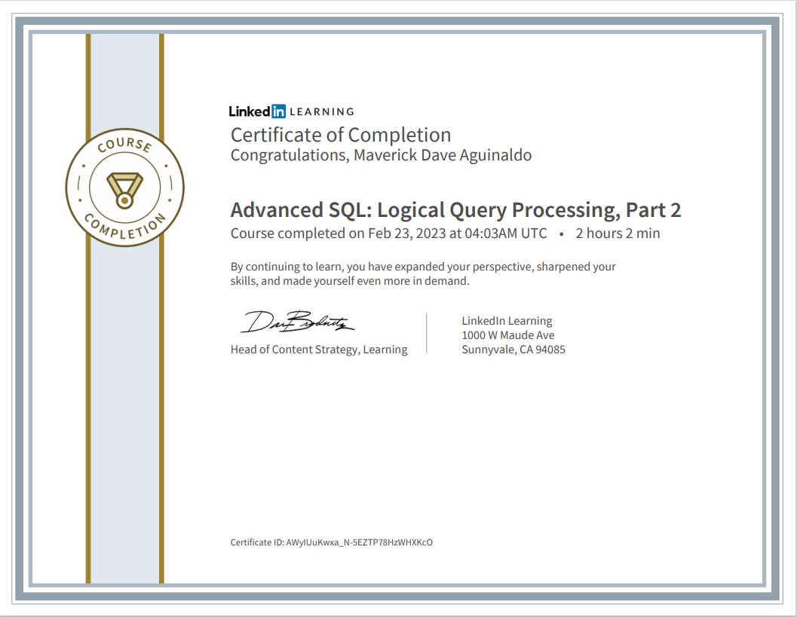 | 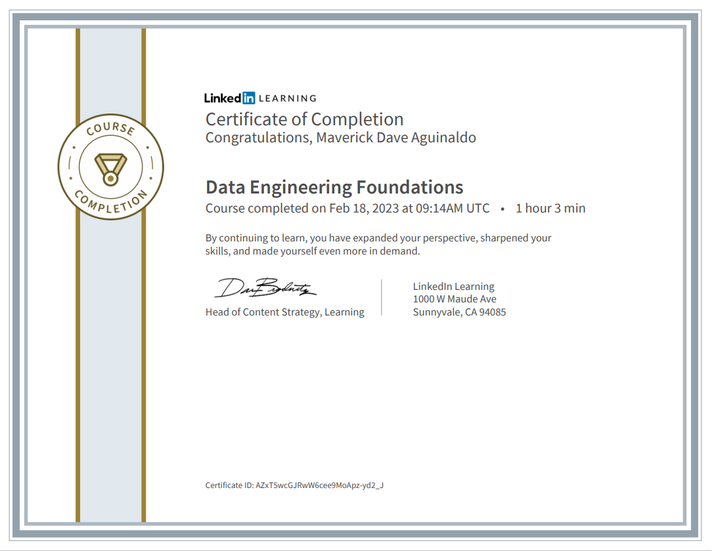 |
|  |  | 

### Other Certifications:

|  |  | 
|----------|----------|
| 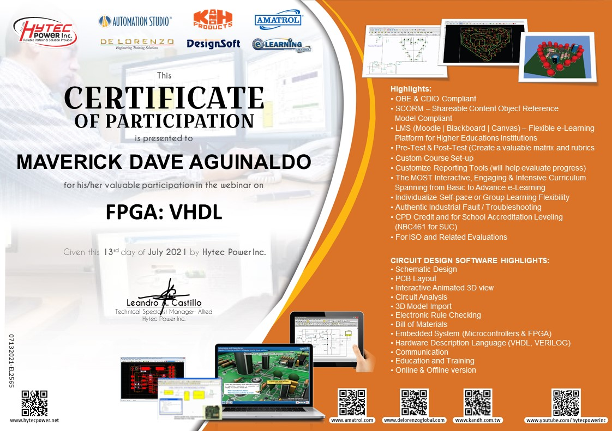 | 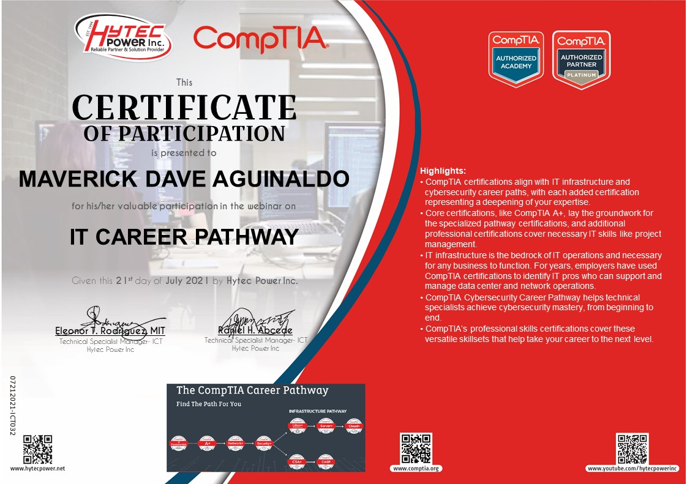 | 
|  |  | 
| 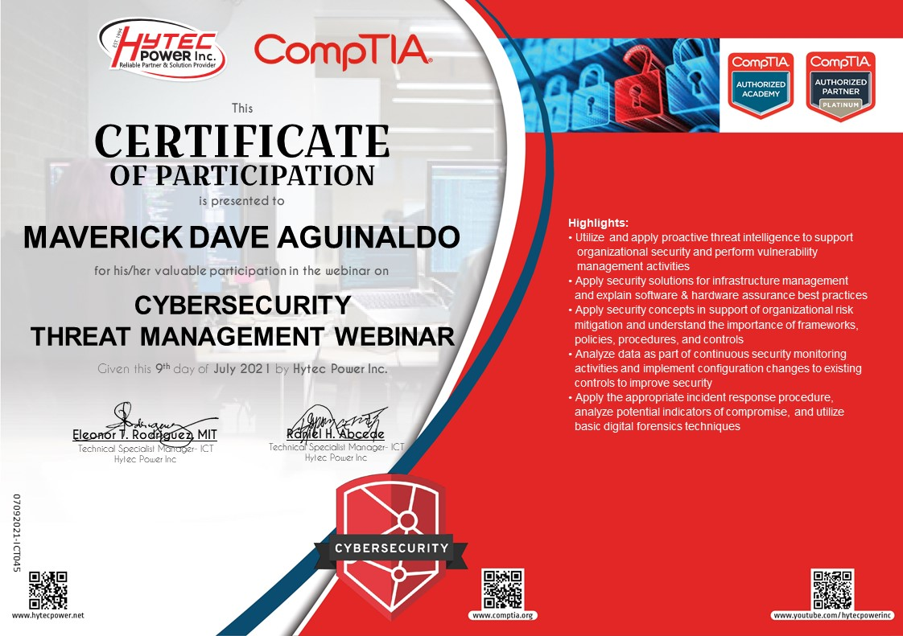 |  | 
|  |  | 

## LeetCode

-   LeetCode profile: [**https://leetcode.com/davdavid29/**](https://leetcode.com/davdavid29/)
-   [**LeetCode SQL Solved Problems**](https://leetcode.com/davdavid29/)
