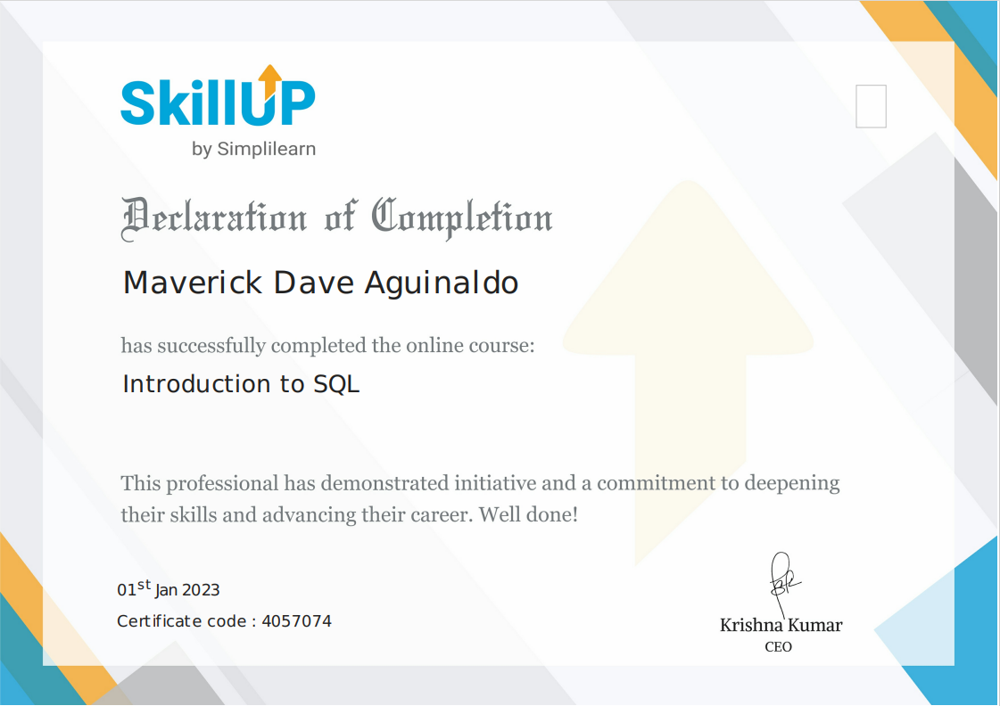

# Trainings and Certifications

This repository contains a list of trainings and certifications I have completed throughout my career.

## Table of Contents

-	[Trainings and Certifications](#trainings-and-certifications)
-	[Passed Certifications](#passed-certifications)
-	[Photos](#photos)

## Trainings and Certifications

-   [**AWS Introduction to Cloud 101**](https://www.credly.com/badges/33ca67ad-0e36-4f5f-ab17-655aaa5e874d/linked_in_profile) by AWS Educate (Apr 2022) - This training course covered the fundamentals of cloud computing and Amazon Web Services (AWS).

-   [**SQL**](https://www.sololearn.com/certificates/CT-RNHNIWK6) by Sololearn (Dec 2022)  &   **[Introduction to SQL](https://simpli-web.app.link/e/FC3NiF6GGwb)** by Simplilearn (Jan 2023)  - This training course provided a comprehensive introduction to SQL, covering the following topics:
	-   Database fundamentals
	-   Data definition language (DDL) and data manipulation language (DML)
	-   Select statements
	-   Functions and operators
	-   Joins and subqueries
	-   Indexes and performance tuning
	-   Transactions and concurrency control
	-   Views and stored procedures
	-   Security and access control

-   [**Data Engineering Foundations**](https://www.linkedin.com/learning/certificates/e6c648895f5ebf2d971842fbbbe33eac6201f6d4723392d347eab5ad2000c3d5) by LinkedIn Learning (Feb 2023) - This training course covered the following topics:
	-   ETL (Extract, Transform, Load)
	-   PostgreSQL database
	-   Apache Spark framework
	-   Python programming language for data engineering
	-   Apache Airflow workflow management tool

-   **Advanced SQL: Logical Query Processing [Part 1](https://www.linkedin.com/learning/certificates/40a6b99cc0cc4ff035a1cb741ed8f419f9046ebbf2d2fd3c970a33fc480c3003), [Part2](https://www.linkedin.com/learning/certificates/a2a1dbe23289c96126fc71f99d2971f2e81780cb0f3a4f28bb72b9bfdcf8722d)** by LinkedIn Learning (Feb 2023) - This training course covered advanced SQL concepts, including logical query processing and optimization.

-   **Zero to Snowflake – Virtual Hands-On Lab** by Snowflake (Apr 2023) - This virtual hands-on lab provided a comprehensive introduction to Snowflake, a cloud-based data warehousing and analytics platform. The lab covered the following topics:
	-   Snowflake architecture and data loading
	-   Data storage and management
	-   Querying and optimizing data with Snowflake
	-   Advanced topics, such as security and governance
    

## Passed Certifications
    
 -   **[Certified SQL Developer](https://verify.w3schools.com/1NCSKCULU1)** by W3Schools (2023) - This certification validates my skills and knowledge in SQL, including database design, querying, and optimization. The certification exam covered the following topics:

	   -   Relational database concepts
	   -   Data manipulation language (DML) statements
	   -   Data definition language (DDL) statements
	   -   Data control language (DCL) statements
	   -   Transaction management
	   -   Database optimization and performance tuning
	   -   Database security and access control
	   -   Backup and recovery strategies
	   -   Common database architectures

## Photos

### Professional Certifications:

|  |  | 
|----------|----------|
|  |  | 
|  |  |
|  |  |
|  |  | 

### Other Certifications:

|  |  | 
|----------|----------|
|  |  | 
|  |  | 
|  |  | 
|  |  | 

